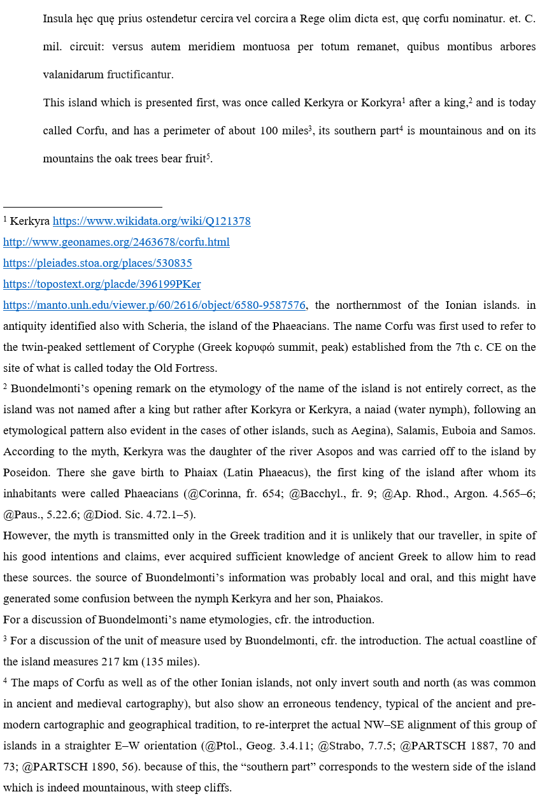

# BDM Tool Documentation

This is based on [Proteus](https://myrmex.github.io/overview/proteus/) with the following flow:

(a) creation and extraction:

1. DOCX is created by author following a few conventions.
2. PDCX is extracted from DOCX like this:

```ps1
.\PickDocx pick c:\users\dfusi\desktop\corfu.docx c:\users\dfusi\Desktop\corfu\ -f -x -m
```

(b) BDM tool import: imports PDCX into a Mongo DB.

## Conventions

### Structure

Each DOCX document contains alternating paragraphs: one is Latin, and the following one is its English translation.

- the Latin paragraph contains just text.
- the English paragraph can have footnotes. Footnotes can include escapes.

This structure ensures that we have 3 data domains:

- Latin text.
- English text.
- comments on English text, whose structure is further defined by escapes.

Figure 1 shows the first page of a sample document: this page contains the first two paragraphs, one with Latin text, and another with its English translation. The second paragraph has some footnotes, which in turn contain some escapes to represent URLs and citations.



- *Figure 1 - DOCX page sample*

### Footnote Escapes

The following textual escapes are conventionally used in the footnotes of DOCX files:

(e1) textual notes are marked with `&` to separate them from commentary notes, i.e.: the first character of a textual note is `&`.

(e2) tokens starting with `http` end with the first whitespace or comma or `)` or at paragraph end. This sequence represents a set of 1 or more URLs, each starting with `http` (i.e. `http[^\s,)]+`). Their anchor text is the token before them: i.e. before http we expect a set of non-whitespaces + whitespace(s). That set is the reference word.

Example:

```txt
Kerkyra https://www.wikidata.org/wiki/Q121378http://www.geonames.org/2463678/corfu.htmlhttps://pleiades.stoa.org/places/530835https://topostext.org/placde/396199PKerhttps://manto.unh.edu/viewer.p/60/2616/object/6580-9587576, the ...
```

(e3) ancient references are prefixed with `@` and have these forms:

- "@author, work, location" terminated by ";" or ")" (e.g. "@Ap. Rhod., Argon. 4.565-6"): pattern `\@(?<a>[^,\d]+),\s*(?<w>[^;),]+),\s*(?<l>[^;)]+)`.
- "@author, location" terminated by ";" or ")" (e.g. "@Paus., 5.22.6"): pattern `\@(?<a>[^,\d]+),\s*(?<l>[^;)]+)`.

(e4) modern references are prefixed with `@` and have form `@AUTHOR YEAR,LOC` where both `YEAR` and `LOC` are digits, but `LOC` can also be digits-digits for a range of pages: pattern `\@(?<a>[^,\d]+)\s+(?<y>[12]\d{3})(,\s*(?<l>[^;)]+))?` (e.g. `@LEONTSINI 2014, esp. 32-35`).

(e5) tags for notes are in `[]` at the very beginning of their text, except when they are preceded by `&` (see `e1` above). Multiple tags are separated by space.

## Entries

From the point of view of Proteus, each paragraph is a `C block` and each footnote a `C fn` (inside a block). The input document is processed block by block, so that each block corresponds to an entries set.

The commands used are:

- `block(open=1)` / `block(open=0)` => regions `lat` or `eng` according to their position (Latin/English blocks alternate in this order).
- `fn(open=1)` / `fn(open=0)` => region `fn`.
- `urls(l=URL_LIST)` representing one or more URLs. URL_LIST is a space-delimited list of URLs.
- `aref(a=AUTHOR, w=WORK, l=LOC)` representing a citation.
- `aref(a=AUTHOR, l=LOC)` representing a citation where the work is implicit. This conventionally happens e.g. for those authors having a single work, like Apollonius Rhodius (*Argonautica*).
- `aref(a=AUTHOR, y=YEAR, l=LOC)` representing a citation from a modern work.
- `tags(l=TAG_LIST)` representing a list of tags. Tags can represent categories or keywords, and are separated by semicolons. Keyword values are prefixed with `%lang:` or `%lang:index:` or just `%`. Example: `%Apollon`; `%eng:Apollon`; `%eng:myth:Apollon`. No prefix means category. Categories are not case sensitive, and get lowercased.

## Cadmus Mapping

The mapping of such Proteus entries to Cadmus is summarized here:

- each **lat** or **eng** region becomes a text item, with these metadata:
  - title = source title + ordinal number (referred to the same language, i.e. = (block number - 1) / 2 + 1).
  - citation = title
  - group ID = source title.
  - flags = 0 for Latin, 1 for English.

- each **fn** inside the `eng` region is mapped to a comment fragment in a comments layer part.

The comment fragment model is:

- tag (string): `lg` when the footnote starts with `&`; else null.
- text (string): all the text entries inside the footnote region.
- references (DocReference[]): its source is `aref`.
  - type (string)
  - tag (string)
  - citation (string)
  - note (string)
- externalIds (string[]): its source is `urls`.
- categories (string[]): its source is `tags`.
- keywords (IndexKeyword[]): its source is `tags`.
  - indexId
  - language*
  - value
  - note
  - tag
